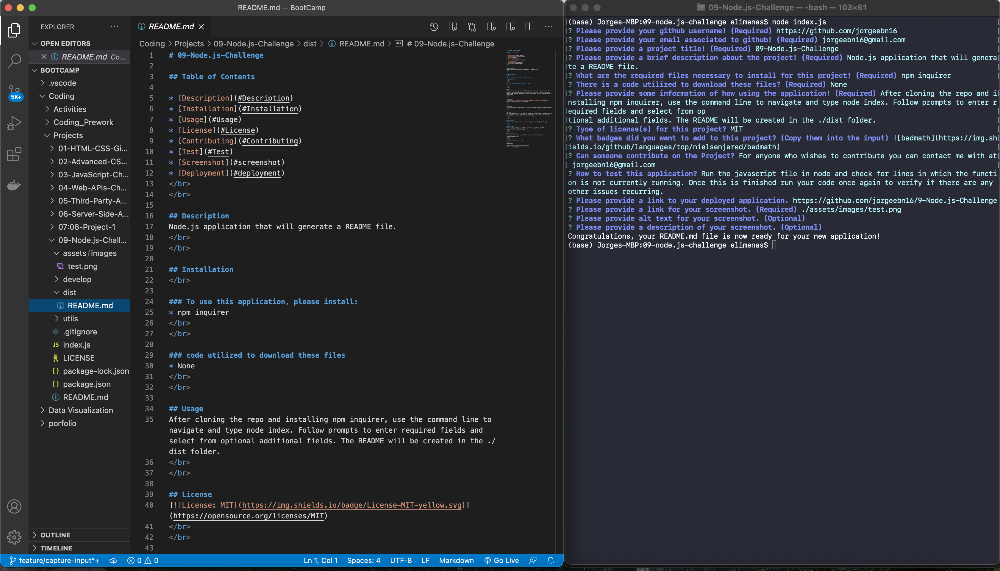

# 09-Node.js-Challenge

## Table of Contents

* [Description](#Description)
* [Installation](#Installation)
* [Usage](#Usage)
* [License](#License)
* [Contributing](#Contributing)
* [Test](#Test)
* [Screenshot](#screenshot)
* [Deployment](#deployment)
 
 

## Description
Node.js application that will generate a README file.
 
 

## Installation
 

### To use this application, please install:
* npm inquirer
 

### Code utilized to download these files?
* None.
 
 

## Usage
After cloning the repo and installing npm inquirer, use the command line to navigate and type node index. Follow prompts to enter required fields and select from optional additional fields. The README will be created in the ./dist folder.
 
 

## License 

 
 

## Badges

 
 

## Test
Run the javascript file in node and check for lines in which the function is not currently running. Once this is finished run your code once again to verify if there are any other issues recurring. 
 
 

## Screenshot

 
 

## Deployment
View the deployed page at [09-Node.js-Challenge](https://github.com/jorgeebn16/9-Node.js-Challenge)
 
 

## Contributing
For anyone who wishes to contribute you can contact me with at jorgeebn16@gmail.com
 
 

Would you like to reach us?
 
Contact Me:

Github: https://github.com/jorgeebn16
Email: jorgeebn16@gmail.com
